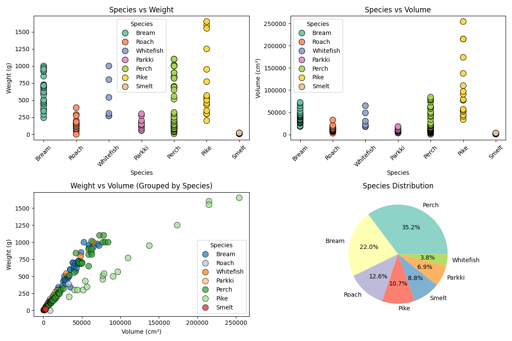

# ProjectR: A Fish 🐟 Data Analysis, Classification and Weight prediction Project. 

## About The Project R

**ProjectR** is a comprehensive data science project focused on the analysis of fish data, and prediction,a nd classification fish attributes. This repository contains a collection of python perform exploratory data analysis, visualize datasets, and build predictive machine learning models, and  and a website based interface for the predictive machine learning model. The core of this project is to classify fish species and predict fish weight based on their physical characteristics.

This project is broken down into several key components: a weight prediction model with a basic web interface (`ProjectRv1`), a data visualization script, and a fish species classification model.

---

## Key Components

This repository is composed of several distinct parts that work together to provide a complete analysis solution.

### 1. ProjectRv1:

`ProjectRv1` is the user-facing web application that serves as an interactive dashboard for the fish weight prediction machine learning model. It allows users to input fish measurements and species and get real-time predictions for species and weight without needing to run the Python scripts directly. It provides a user-friendly interface to the powerful XGBoostRegression based machine learning model built in this project, for fish weight predictions from it's other attributes. The fish species is encoded with an one hot encoder.

### 2. Fish Dataset Visualization (`fishdatasetVisualisation.py`):

Before building any models, it's crucial to understand the data. The `fishdatasetVisualisation.py` program is dedicated to **Exploratory Data Analysis (EDA)**. It uses libraries like Matplotlib and Seaborn to generate various plots and charts to uncover patterns, identify correlations between different physical measurements, and understand the distribution of different fish species in the dataset.

_Output visualization from the EDA script._

### 3. Fish Species Classifier (`fishSpeciesClassifier.py`):

The `fishSpeciesClassifier.py` program focuses on implementing a machine learning classification model named **XGBoostClassifier**. The goal is to accurately identify the species of a fish based on its measurements (like vertical, diagonal, and cross lengths; height; and width).

* **Algorithm:** This program implements a powerful ensemble based classification algorithm named **XGBoostClassifier** such to handle this multi-class classification problem.
* **Purpose:** The trained model can be used to automatically categorize new, unseen fish data.

### 4. Fish Weight Predictor (`fishWeightsPredictor.py`):

The `fishWeightsPredictor.py` script implementa a machine learning regression model named **XGBoostRegressor** to predict the weight of a fish. This is a classic regression task where the model learns the relationship between the fish's physical dimensions and its weight.

* **Algorithm:** This model implements a powerful ensemble based regression algorithm named **XGBoostRegressor**.
* **Purpose:** This provides a predictive tool to estimate a fish's weight, which is another key feature integrated into the `ProjectRv1` web app.

---

## Technologies and Algorithms:

This project leverages several key technologies and machine learning concepts:

* **Programming Language:** **Python**
* **Data Science Libraries:**
    * **Pandas:** For data manipulation and handling the dataset.
    * **NumPy:** For numerical operations.
    * **Scikit-learn:** For building, training, and evaluating the machine learning models.
    * **Matplotlib & Seaborn:** For data visualization and creating the plots.
* **Web Framework (for ProjectRv1):** Likely **Flask** or **Django**.
* **Core Algorithms:**
    * **Classification:** SVM, Random Forest, KNN, etc.
    * **Regression:** Linear Regression, Gradient Boosting, etc.

